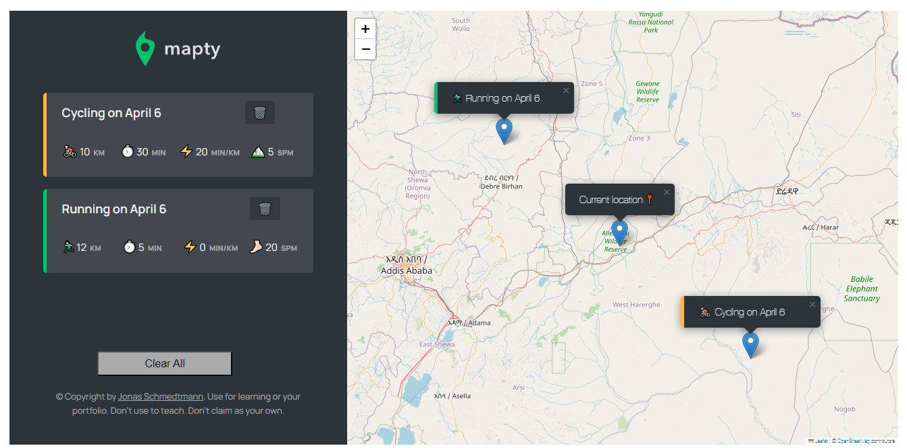

# Mapty Project

Mapty is a project created as part of an Advanced JavaScript course on [Udemy Course](https://www.udemy.com/course/the-complete-javascript-course/) by instructor Jonas Schmedtmann. The project uses a Geolocation API to determine the user's location and a third-party library called Leaflet to display a map on half of the page. The user can click anywhere on the map to add a cycling or running workout using a form. The workout data is then stored in a list and the local storage of the browser, so that the user doesn't loose his/her workout data whenever the come to for the next timne.

<h1 align="center">
    
</h1>


## 💡 Getting Started

To view this project, simply access [this link](https://hariyebk.github.io/Mapty/). Alternatively, you can also download or clone the repository from
[GitHub](https://github.com/hariyebk/Mapty) using the following command. 

```
git clone https://github.com/hariyebk/Mapty.git
```
Once you have cloned the repository, you can open the `index.html` file in your web browser to view the Mapty application.

## ⭐ Using Mapty

When you first open the Mapty application, you will be prompted to allow the browser to access your location. If you allow access, the application will zoom in on your current location on the map. If you decline access, the map will default to a location in London.

To add a workout, simply click on the map at the location where you want to start your workout. This will open a form where you can enter details about your workout, including the type of workout (cycling or running), the distance, the duration, and any notes you want to include.

After you submit the form, your workout will be added to the list of workouts on the left-hand side of the page. You can click on any workout in the list to view its location on the map.

To delete a workout, simply click on the "Delete" button in the specific workout you are interested to delete. You can also clear all workouts by clicking the "Clear Workouts" button at the bottom of the workout list.

##💎Technologies Used
The following technologies were used to build this project:

<p align="center">


</p>

## 📍Future Improvements

While Mapty is a fully functional application, there are several areas where it could be improved. Some possible improvements include:

- Adding support for more workout types, such as swimming or hiking
- Allowing users to edit existing workouts
- Adding the ability to share workouts with others via social media or email
- Making the application responsive so it looks good on all devices

## ✨Contributing 

Contributions are welcome and encouraged! To contribute please follow these steps:

1. Fork this repository by clicking on "Fork" button at right top corner of page.
2. Create new branch: `git checkout -b my-new-feature`
3. Make changes to files according to desired feature(s).
4. Commit your changes: `git commit -am 'Add some feature'`.
5. Push to the branch: `git push origin my-new-feature`
6 Submit a pull request by opening PR in original respository (not yours)

I review all pull requests thoroughly and appreciate every contribution made.


If you find any bugs/issues/errors please create an issue ticket/appropriate category within issues in Github.

## About

This project was developed in The Complete JavaScript Course 2023: From Zero to Expert! couse.
https://www.udemy.com/course/the-complete-javascript-course/

Created by ** Jonas Schmedtmann ** <br>
Developed by ** Harun Bekri **


## License 

This project is licensed under MIT license - see LICENSE.md for more details.

## Conclusion

Mapty is a fun and useful application that demonstrates how to use the Geolocation API and Leaflet.js to create a map-based application. By following the instructions in this README file, you should be able to clone the repository and start using Mapty on your own machine.
